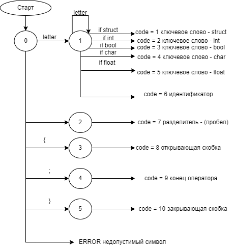

# CSharpTFLLab
# Супер C компилятор

Супер C компилятор - это учебный проект компилятора для языка программирования С
Разработчик: Иванов Артур  АВТ-114

## История версий

0.1 - текстовый редактор

0.2 - лексический сканер

## Установка

Приложение является портативным и запускается через соответсвующий exe файл

## Использование

Программа может работать с текстовыми файлами типа С.
Для этого у пользователя есть функции для работы с файлами:
Создать новый файл;
Открыть существующий файл;
Сохранить файл;
Сохранить как новый файл;
Выход - завершает программу.

Для работы с текстом для пользователя реализованы следующие функции:
Отменить предыдущее изменение;
Повторить изменение;
Вырезать выделенный текст в буфер обмена;
Копировать выделенный текст в буфер обмена;
Вставить текст из буфера обмена;
Удалить выделенный текст;
Выделить весь текст из области редактирования файла.

Функции для отладки и запуска исполняемого кода - находятся ещё в разработке.

Обращайтесь к справке для проверки актуальной версии и пояснении в программе.

В последней версии реализован лексический сканер, который работает по следующей схеме:
