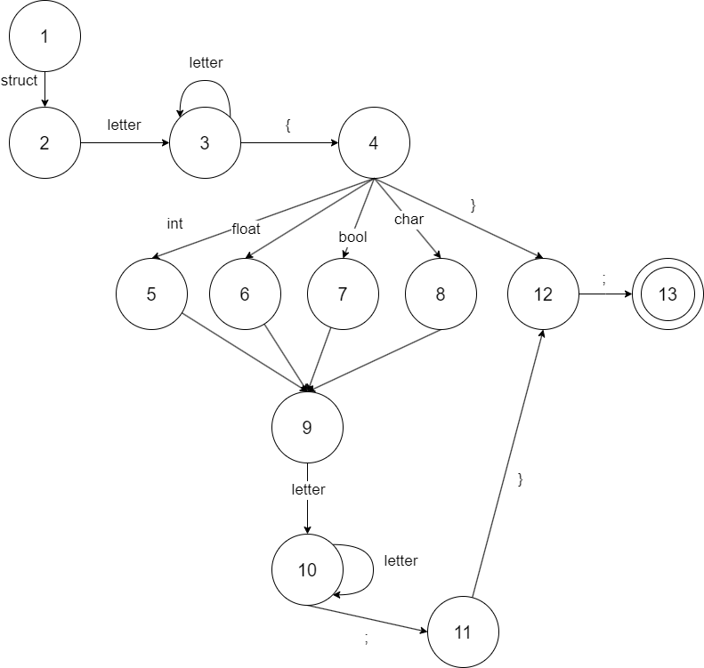

# CSharpTFLLab
# Супер C компилятор

Супер C компилятор - это учебный проект компилятора для языка программирования С
Разработчик: Иванов Артур  АВТ-114

## История версий

0.1 - текстовый редактор

0.2 - лексический сканер

0.3 - парсер

## Установка

Приложение является портативным и запускается через соответсвующий exe файл

## Использование

Программа может работать с текстовыми файлами типа С.
Для этого у пользователя есть функции для работы с файлами:
Создать новый файл;
Открыть существующий файл;
Сохранить файл;
Сохранить как новый файл;
Выход - завершает программу.

Для работы с текстом для пользователя реализованы следующие функции:
Отменить предыдущее изменение;
Повторить изменение;
Вырезать выделенный текст в буфер обмена;
Копировать выделенный текст в буфер обмена;
Вставить текст из буфера обмена;
Удалить выделенный текст;
Выделить весь текст из области редактирования файла.

Функции для отладки и запуска исполняемого кода - находятся ещё в разработке.

Обращайтесь к справке для проверки актуальной версии и пояснении в программе.

## Семантика
### Постановка задачи
Разработать лексический анализатор для объявления структуры на С.
Лексический анализатор - программно написанный модуль, который проверяет семантику программного кода, на наличие лексических ошибок.
Это необходимый модуль программы, без которого не сможет работать синтаксический автомат.

### Персональный вариант задания на лабораторную работу
struct a {
	int i;
	char c;
	float f;
};

### Примеры допустимых строк
Любые буквы и числа, а так же символы {};

### Правильный тестовый пример
struct a f {{}; int
truct4 gd }} float

### Неправильный тестовый пример
^4$struct rrr {;
!3@) dddd struct

### Схема лексического сканера

## Парсер
### Постановка задачи
Разработать парсер для объявления структуры на С.
Парсер — это программа, сервис или скрипт, который собирает данные и преобразует их в нужный формат на основе определённой грамматике.
В данном варианте - парсер создаёт структуру С из строку.

### Персональный вариант задания на лабораторную работу
struct a {
	int i;
	bool c;
	float f;
};

### Примеры допустимых строк
struct str { };

struct a {
	struct b {
		struct c {
		};
	};
};

struct s {
	int a;
	float b;
	bool c;
};

### Грамматика
1. \<STRUCT> -> "struct" \<DEFINE>
2. \<DEFINE> -> _ \<ID>
3. \<ID> -> letter \<IDREM>
4. \<IDREM> -> letter \<IDREM> | "{" \<INIT>
5. \<INIT> -> (("int" | "char" | "float" | "bool") \<IDNAME>) | (";" \<CLOSE>)
6. \<ID> -> _ \<NAME>
7. \<NAME> -> letter \<ENDNAME>
8. \<ENDNAME> -> (letter \<ENDNAME>) | (";" \<INIT>) | (";" \<CLOSE>)
9.  \<CLOSE> -> "}" \<END>
10. \<END> -> ";"

\<letter> → "a" | "b" | "c" | ... | "z" | "A" | "B" | "C" | ... | "Z" | 
\<digit> → "0" | "1" | "2" | "3" | "4" | "5" | "6" | "7" | "8" | "9"

### Классификация грамматики
Автоматная грамматика

### Правильные тестовые примеры
struct str { };

struct a {
	struct b {
		struct c;
		};
	};
};

struct s {
	int a;
	float b;
	bool c;
};

### Неправильные тестовые примеры
struct { };

struct a
	struct b
		struct c;
		};
	};
};

struct s {
	int a
	float b
	bool c
}

## Анализатор ошибок
### Метой Айронса
Алгоритм ищет следующую правильную лексему, игнорируя неправильные

### Схема лексического сканера

## Скриншоты
### Пример

### Ошибка
